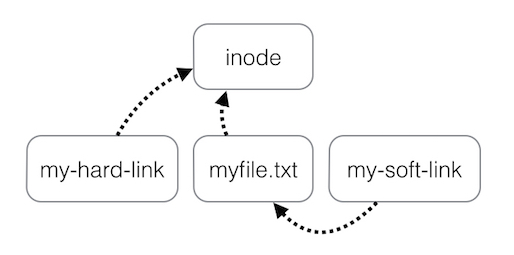

# Notes on The Linux Command Line (by W. E. Shotts Jr.)

## edited by Gopher

---

### File,  file systems and commands

1. `ls`

    -a(all) -d(directory) -h(human-readable)

2. `less` (show file content)

3. FHS

   1. /bin: Contains binaries (programs) that must be present for the system to boot and run.

   2. /boot: Contains the Linux kernel, initial RAM disk image (for drivers needed at boot time), and the boot loader.

      `boot/grub/grub.conf` or menu.lst, which are used to configure the boot loader
       `/boot/vmlinuz`, the Linux kernel

   3. /dev: Device nodes

   4. /etc: The `/etc` directory contains all of the system-wide configuration files. It also contains a collection of shell scripts which start each of the system services at boot time. Everything in this directory should be readable text.

   5. /home:  Ordinary users can only write files in their home directories

   6. /lib: Shared library files.

   7. /lost+found

   8. /mnt

   9. /opt: This is mainly used to hold commercial software products that may be installed on your system.

   10. /proc

   11. /root

   12. /sbin: This directory contains “system” binaries. These are programs that perform vital system tasks that are generally reserved for the superuser.

   13. /tmp

   14. /usr: Unix software resources. It contains all the programs and support files used by regular users.

      `/usr/bin` contains the executable programs installed by your Linux distribution. Shared libraries of programs contained in it are stored in `/usr/lib`.

      The `/usr/local` tree is where programs that are not included with your distribution but are intended for system-wide use are installed. Programs compiled from source code are normally installed in `/usr/local/bin`. 

      `/usr/sbin` contains more system administration programs.

   15. /var

      `/var/log` records of various system activity


4. Wildcards

   ​
   | Wildcard        | Meeaning                                 |
   | --------------- | ---------------------------------------- |
   | \*              | Matches any characters                   |
   | ?               | Matches any single character             |
   | \ [characters\] | Matches any character that is a member of the set characters |
   | \[!characters\] | Matches any character that is not a member of the set characters |
   | \[\[:class:\]\] | Matches any character that is a member of the specified class |

   Commonly used character classes
   | Character class | Meaning                            |
   | --------------- | ---------------------------------- |
   | \[:alnum:\]     | Matches any alphanumeric character |
   | \[:alpha:\]     | Matches any alphabetic character   |
   | \[:digit:\]     | Matches any numeral                |
   | \[:lower:\]     | Matches any lowercase letter       |
   | \[:upper:\]     | Matches any uppercase letter       |

5. `cp`

   `-a`(--archive, copy with attributes) `-u`(--update, update only -- do not override)  

6. Be careful with `rm`! `ls` first before you `rm -rf`.

7. `ln` 

   `-s`(soft/symbolic link)
   

8. Something with command


      1. type – Indicate how a command name is interpreted
      2. which – Display which executable program will be executed
      3. help – Get help for shell builtins
      4. man – Display a command's manual page
      5. apropos – Display a list of appropriate commands
      6. info – Display a command's info entry
      7. whatis – Display a very brief description of a command
      8. alias – Create an alias for a command


To learn more about Steve Bourne, father of the Bourne Shell, see this Wikipedia
article:
http://en.wikipedia.org/wiki/Steve_Bourne
Here is an article about the concept of shells in computing:
http://en.wikipedia.org/wiki/Shell_\(computing\)
The full version of the Linux Filesystem Hierarchy Standard can be found here:
http://www.pathname.com/fhs/
An article about the directory structure of Unix and Unix-like systems:
http://en.wikipedia.org/wiki/Unix_directory_structure
A detailed description of the ASCII text format:
http://en.wikipedia.org/wiki/ASCII
The Bash Reference Manual is a reference guide to the bash shell. It’s still a ref-
erence work but contains examples and is easier to read than the bash man page.
http://www.gnu.org/software/bash/manual/bashref.html
The Bash FAQ contains answers to frequently asked questions regarding bash.
This list is aimed at intermediate to advanced users, but contains a lot of good in-
formation.
http://mywiki.wooledge.org/BashFAQ
The GNU Project provides extensive documentation for its programs, which form
the core of the Linux command line experience. You can see a complete list here:
http://www.gnu.org/manual/manual.html
Wikipedia has an interesting article on man pages:
http://en.wikipedia.org/wiki/Man_page
A discussion of symbolic links: 
http://en.wikipedia.org/wiki/Symbolic_link

---

### Redirection

1. Commands
   1. cat - Concatenate files
   2. sort - Sort lines of text
   3. uniq - Report or omit repeated lines
   4. grep - Print lines matching a pattern
   5. wc - Print newline, word, and byte counts for each file
   6. head - Output the first part of a file
   7. tail - Output the last part of a file
   8. tee - Read from standard input and write to standard output and files

2. `>`:truncate / redirect stdout
   `2>`: redirect stderr

   `2>&1`: redirect stderr to (redirected) stdout

   `&>`: redirect both stderr and stdout

   `&>>`: redirect with append

   `2> /dev/null`: redirect stderr to bit bucket (supress stderr)

3. > The redirection operator silently creates or overwrites files, so you need to treat it with a lot of respect
   > e.g. (this will override/destroy `less`)
   > cd /usr/bin
   > ls > less

---

### Shell basics and terminal keystrokes

1. `~`(tilde) = /home/user_name

2. Arithmetic expansion:`$((expression))` (`/` divide into **integers**, `**` exponentiation, `()` should contains expressions like `$(())`)

3. `{}` expands ranges. e.g. `{1-2000}-{a-z}`

4. Parameter expansion: `printenv`, `$env`

5. Command substitution: `command1 $(command2)` or  ``command1 `command2` ``  

6. Quoting:

      `""` expand expression (treats space as space, e.g., try `echo $(cal)` and `echo "$(cal)"`)
      `''` treat literally
      `\` escape carriage return
      `/`  espace special characters 

7. Keystrokes (Emacs style)

   ​

   | Key           | Meaning                                  |
   | ------------- | ---------------------------------------- |
   | Ctrl-a        | Move cursor to the beginning of the line. |
   | Ctrl-e        | Move cursor to the end of the line.      |
   | Ctrl-f        | Move cursor forward one character; same as the right arrow  key. |
   | Ctrl-b        | Move cursor backward one character; same as the left arrow key. |
   | Alt-f         | Move cursor forward one word.            |
   | Alt-b         | Move cursor backward one word.           |
   | Ctrl-l        | Clear the screen and move the cursor to the top left corner. The clear command does the same thing. |
   | Ctrl-d        | Delete the character at the cursor location/ in text editor, insert EOF |
   | Ctrl-t        | Transpose (exchange) the character at the cursor location with the one preceding it. |
   | Alt-t         | Transpose the word at the cursor location with the one preceding it. |
   | Alt-l         | Convert the characters from the cursor location to the end of the word to lowercase. |
   | Alt-u         | Convert the characters from the cursor location to the end of the word to uppercase. |
   | Ctrl-k        | Kill text from the cursor location to the end of line. |
   | Ctrl-u        | Kill text from the cursor location to the beginning of the line. |
   | Alt-Backspace | Kill text from the cursor location to the beginning of the current word. If the cursor is at the beginning of a word, kill the previous word. |
   | Ctrl-y        | Yank text from the kill-ring and insert it at the cursor location. |

8. `history`: C-r (Reverse incremental search.)


The bash man page has major sections on both expansion and quoting which cover these topics in a more formal manner.
The Bash Reference Manual also contains chapters on expansion and quoting:
http://www.gnu.org/software/bash/manual/bashref.html
The Wikipedia has a good article on computer terminals:
http://en.wikipedia.org/wiki/Computer_terminal


---

### Permission and process


1. `su` – Run a shell with substitute user and group IDs
   `sudo` – Execute a command as another user

2. r (4) w (2) x (1); u(user) o(other) g(group)

3. File types:

   | Type | Meaning                                  |
   | ---- | ---------------------------------------- |
   | c    | A character special file. This file type refers to a device that handles data as a stream of bytes, such as a terminal or modem. |
   | b    | A block special file. This file type refers to a device that handlesdata in blocks, such as a hard drive or CD-ROM drive. |
   | l    | A symbolic link. Notice that with symbolic links, the remaining file attributes are **always “rwxrwxrwx” and are dummy values**. The real file attributes are those of the file the symbolic link points to |


| Attribute | Files                                    | Directory                                |
| --------- | ---------------------------------------- | ---------------------------------------- |
| r         | Allows a file to be opened and read.     | Allows a directory's contents to be listed if the execute attribute is also set. |
| w         | Allows a file to be written to or truncated, however this attribute does not allow files to be renamed or deleted. The ability to delete or rename files is determined by directory attributes. | Allows files within a directory to be created, deleted, and renamed if the execute attribute is also set. |
| x         | Allows a file to be treated as a program and executed. Program files written in scripting languages must also be set as readable to be executed. | Allows a directory to be entered, e.g., cd directory. |

5. Special permissions:

   1. `setuid`(4000 or u+s): When applied to an executable file, it sets the effective user ID from that of the real user (the user actually running the program) to that of the program's owner. e.g. let a program runs as root.

   2. `setgid`(2000 or g+s): changes the effective group ID from the real group ID of the real user to that of the file owner. If the setgid bit is set on a directory, newly created files in the directory will be given the group ownership of the directory rather the group ownership of the file's creator. *This is useful in a shared directory when members of a common group need access to all the files in the directory, regardless of the file owner's primary group*.

   3. `sticky`(1000 or +t):  If applied to a directory, it prevents users from deleting or renaming files unless the user is either the owner of the directory, the owner of the file, or the superuser. This is often used to control access to a shared directory, such as `/tmp`.

   4. `su`: -l(or -, get login shell, default to root); -c(single command)

   5. `chown`: (user):(group)

   6. Process
           ps – Report a snapshot of current processes (ps aux)
           top – Display tasks
           jobs – List active jobs
           bg – Place a job in the background
           fg – Place a job in the foreground
           kill – Send a signal to a process
           killall – Kill processes by name
           shutdown – Shutdown or reboot the system

   7. Process status:

   | Status | Meaning                                  |
   | ------ | ---------------------------------------- |
   | R      | Running. This means that the process is running **or ready to run**. |
   | S      | Sleeping.                                |
   | D      | Uninterruptible Sleep. Process is waiting for I/O such as a disk drive. |
   | T      | Stopped.                                 |
   | Z      | A defunct or “zombie” process. This is a child process that has terminated, but has not been cleaned up by its parent. |
   | <      | A high priority process (richness)       |
   | N      | A low priority process (nice)            |

   8. top:

      1. %us: user process
      2. %sy: kernel process
      3. %ni: nice process
      4. %id: idle
      5. %wa: waiting for I/O.

   9. `&`: put in background; `%` specify job number (jobspec)

   10. `kill`: -signal_number PID

     process signal:

   | Number | Signal | Meaning                                  |
   | ------ | ------ | ---------------------------------------- |
   | 1      | HUP    | Hangup                                   |
   | 2      | INT    | Interrupt                                |
   | 9      | KILL   | Kill immediately (cannot be ignored)     |
   | 15     | TERM   | Terminate (do clean-up before terminate) |
   | 18     | CONT   | Continue, restore a process after a STOP |
   | 19     | STOP   | Stop. This signal causes a process to pause (cannot be ignored) |
   | 20     | TSTP   | Terminal stop, can be ignored            |

   11.  ​
       pstree: Outputs a process list arranged in a tree-like pattern showing the parent/child relationships between processes.
       vmstat: Outputs a snapshot of system resource usage;
       xload A graphical program that draws a graph showing system load over time.
       tload: Similar to the xload program, but draws the graph in the terminal


---

### The environment and packages (apt-get)

1. Login shell (`/etc/profile`, global, or `~/.bash_profile`,`~/.bash_login`,`~/.profile` for local user) and non-login shell (`/etc/bash.bashrc`, global, or `~/.bashrc`)

2. Environment variables:

   ​

   | Variable | Meaning                                  |
   | -------- | ---------------------------------------- |
   | PATH     | A colon-separated list of directories that are searched when you |
   | PS1      | Prompt String 1. This defines the contents of your shell prompt |
   | TERM     | Terminal type                            |

3. Apt-get

   1. Update repo: `apt-get update`
   2. Search: ` apt-cache search search_string`
   3. Update: `apt-get install package_name`
   4. Install/update (dpkg): `dpkg --install package_file`
   5. Remove: `apt-get remove package_name`
   6. List:`dpkg --list`
   7. Status: `dpkg --status package_name`
   8. Description: `apt-cache show package_name`
   9. File identification: `dpkg --search file_name`

The Debian GNU/Linux FAQ chapter on package management provides an over-
view of package management on Debian systems :
http://www.debian.org/doc/FAQ/ch-pkgtools.en.html
The home page for the RPM project:
http://www.rpm.org
The home page for the YUM project at Duke University:
http://linux.duke.edu/projects/yum/
For a little background, the Wikipedia has an article on metadata:
http://en.wikipedia.org/wiki/Metadata


---

### Storage and networking

1. Storage related commands:

   1. mount – Mount a file system
   2. umount – Unmount a file system
   3. fsck – Check and repair a file system
   4. fdisk – Partition table manipulator
   5. mkfs – Create a file system
   6. fdformat – Format a floppy disk
   7. dd – Write block oriented data directly to a device
   8. genisoimage (mkisofs) – Create an ISO 9660 image file
   9. wodim (cdrecord) – Write data to optical storage media
   10. md5sum – Calculate an MD5 checksum

2. Devices:

   1. `/dev/hd*`: IDE (PATA)
   2. `/dev/sd*`: SCSI (including PATA/SATA hard disks, flash drives, and USB mass storage devices
   3. `/dev/sr*`: Optical disk
   4. `/dev/lp*`: Printer

3. `sudo tail -f /var/log/messages`: System log (including history of removable devices)

4. `dd if=input_file of=output_file [bs=block_size [count=blocks]]`: **Use with caution!**

5. Networking:

   1. ping - Send an ICMP ECHO_REQUEST to network hosts
   2. traceroute - Print the route packets trace to a network host
   3. netstat - Print network connections, routing tables, interface statistics, mas-
   4. uerade connections, and multicast memberships
   5. ftp - Internet file transfer program
   6. wget - Non-interactive network downloader
   7. ssh - OpenSSH SSH client (remote login program)

6. >  SFTP is based on SSH


For a broad (albeit dated) look at network administration, the Linux Documentation Project provides the Linux Network  Administrator’s Guide:
   http://tldp.org/LDP/nag2/index.html
   Wikipedia contains many good networking articles. Here are some of the basics:
   http://en.wikipedia.org/wiki/Internet_protocol_address
   http://en.wikipedia.org/wiki/Host_name
   http://en.wikipedia.org/wiki/Uniform_Resource_Identifier

---

### Searching, archive and backup

1. Searching

   1. locate – Find files by name
   2. find – Search for files in a directory hierarchy
   3. xargs – Build and execute command lines from standard input
   4. touch – Change file times
   5. stat – Display file or file system status
2. Find
   1. Test: `-type (f/d), -name "regex", -size +/-n(k/M/G etc), -iname(case insensitive),-cmin +/- n(modified more/less than n mins)`
   2. Operator:`-not(n) -or(o) -and(a)`, `-and` is implicit, `\` to escape `()`, the shell characters
   3. Action:  `-delete -ls -print -quit `
      1. User-defined: `-exec command '{}' ';'` , `'` to escape shell characters, `-exec command'{}' +`, apply command on all output,use  `-ok` in place of `-exec`  to do execution interactively
   4. Option: `-depth`(Direct find to process a directory’s files before the directory itself. *This option is automatically applied when the `-delete` action is specified.*), `-maxdepth/mindepth levels`, `-iname`: locate inode, can be used to delete inode with which files has weird name 
   5. `xargs`: accepts input from standard input and converts it into an argument list for a specified command . e.g., `find ~ -iname '*.jpg' -print0 | xargs --null ls -l`:  Deal with those containing embedded spaces in file names by changing delimiter from space to null. 
3. gzip/gunzip, bzip2/bunzip2  
4. `tar`:` -x`(extract), ` t`(content), `c`(create), `r`(append) ,`f`(followed by tar name), `v`(--verbose), `z`(gzip). e.g.,`tar cf file_compressed.tar fils_to_compress` 
   important: tar path is relative not absolute!
   Using tar with find is a good way of creating incremental backups of a directory tree or an entire system. By using find to match files newer than a timestamp file, we could create an archive that only contains files newer than the last archive, assuming that the timestamp file is updated right after each archive is created.
5. ` ssh remote-sys 'tar cf - Documents' | tar xf -` tar remote file and untar at local, - stands for stdin/stdout


---

### Regex


1. `grep`: grep [options] regex [file...]

| Option | Meaning                                  |
| ------ | ---------------------------------------- |
| -i     | --ignore-case                            |
| -v     | --invert-match (print lines that don't match) |
| -l     | --files-with-matches (match only file names) |
| -L     | --files-without-match (invert match file names) |
| -n     | --line-number (prefix each matching line with the number of the line within the file) |

2. Metacharacters:

   1. `.`:  match any character in that character position

      >  `.* `accepts any sequence of characters, including an empty string.

   2. `^` and `$`: cause the match to occur only if the regular expression is found at the beginning of the line (`^`) or at the end of the line (`$`). e.g., `^exact_matching$`

   3. `[character_set]`: `[bg] `, b or g, `[^bg]` no b or g, `[a-z]`, a to z

   4. POSIX character classes

| Class               | Description                              |
| ------------------- | ---------------------------------------- |
| [:alnum:]           | The alphanumeric characters. In ASCII, equivalent to:[A-Za-z0-9]. |
| [:word:]            | [:alnum:] + _                            |
| [:alpha:]           | The alphabetic characters. In ASCII, equivalent to: [A-Za-z] |
| [:blank:]           | Space and tab                            |
| [:digit:]           | 0-9                                      |
| [:lower:]/[:upper:] | Lower/upper case of characters           |
| [:punct:]           | Punctuation:[-!"#$%&'()*+,./:;<=>?@[\\\]_`{\|}~] |
| [:space:]           | space, tab, carriage, return, newline, vertical tab, and form feed([ \t\r\n\v\f]) |

3. Extended regex
   1. `egrep` = `grep -E`: grep with extended regex

   2. `?`: match an element zero or one time

   3. `+`: match an element one or more times

   4. `*`: match an element zero or more times

      >  e.g. `^([[:alpha:]]+ ?)+$` :match lines consisting of groups of one or more alphabetic characters separated by single spaces

   5. `{m,n}`: min/max repetition m/n. m or n can be omitted

---

### Text processing

1. cat – Concatenate files and print on the standard output (-A display invisible symbols)
2. sort – Sort lines of text files
3. uniq – Report or omit repeated lines
4. cut – Remove sections from each line of files
5. expand - replace tabs with spaces
6. paste – Merge lines of files
7. join – Join lines of two files on a common field
8. comm – Compare two sorted files line by line
9. diff – Compare files line by line (-c context; -u unified; prepare for patch:`diff -Naur`)
10. patch – Apply a diff file to an original
11. tr – Translate(replace) or delete characters

   >tr -d '\r' < dos_file > unix_file >convert win to unix (EOL)
12. sed – Stream editor for filtering and transforming text 
13. `sed -option 'address/regex/replacement/flag'`: substitute regex with replacement
14. One of the flag, `g` performs substitution on every instance


| Address     | Meaning                                  |
| ----------- | ---------------------------------------- |
| n           | line n                                   |
| $           | the last line                            |
| /regexp/    | basic regex only                         |
| addr1,addr2 | lines between addr1 and addr2            |
| addr1~steps | the addr1 line and every "steps" lines after |
| addr1,+n    | addr1 and n lines after                  |
| addr1!      | except addr1                             |

12.  `sed` back references: If the sequence \n appears in replacement where n is a number from 1 to 9, the sequence will refer to the corresponding subexpression in the preceding regular expression. 


| Sed manipulation | Meaning                                  |
| ---------------- | ---------------------------------------- |
| s                | substitute                               |
| p                | print                                    |
| d                | delete                                   |
| a                | append                                   |
| i                | insert in front of                       |
| y/set1/set2      | Perform transliteration by converting characters from set1 to the corresponding characters in set2. `sed` requires that both sets be equal size |
|                  |                                          |

12.   advanced: awk, perl

13.   aspell – Interactive spell checker


---

### Formatting output and printing

1. nl – Number lines
2. fold – Wrap each line to a specified length:`fold -w(width) n`
3. fmt – A simple text formatter
4. pr – Prepare text for printing
5. printf – Format and print data
6. groff – A document formatting system
7. pr – Convert text files for printing
8. lpr – Print files
9. a2ps – Format files for printing on a PostScript printer
10. lpstat – Show printer status information
11. lpq – Show printer queue status
12. lprm – Cancel print jobs
13. Page description language(PDL), Raster image processor (RIP)

---

### Shell script

1. `#!`： shebang, tells the system the name of the interpreter

2. Use `\` to escape special operators

3. `var="value"`, use by `$var`
   `declare -r CONSTANT_VAR`

4. local: `LOCAL_VAR`

5. Here command (feed text to command through stdin, *single and double quotes within "here documents" lose their special meaning to the shell*):
           command << token
           text
           token

6. Shell function
           function_name (parameter) {
           commands
           return
           }

7. Control flow
           if commands; then
           commands
           [elif commands; then
           commands...]
           [else
           commands]
           fi
      What included in`[]` is called test statement. It returns either true or false.
      Regex can be evaluated in `[[]]` (bash specification)
      Integer operation can be done in `(())`

8. Exit status: `$?`, 0 for success. Check command man page for error code.

9. File operation: -nt(newer than) -ot(older than) -e(exist) -d(directory) -r(regular) 

10. String operation : ==(equal), <,>(sorted after/before), -n(nonezero), -z(zero)

11. Integer operation: -eq, -ne, -le...

12. Logical: -a(and,&&), -o(or,||), !(not), =~(inequal)

13. Loop

      ```
      While (statement); do
      statement   
      done

      for variable [in words]; do
      commands
      done

      for (( expression1; expression2; expression3 )); do
      commands
      done
      ```

14. Branching:

      ```
      case word in    
      pattern commands ;;
      ...
      esac  
      ```

15. Positional parameters: `\$0(usually filename)` ` \$#(num of args)`

16. Parameter expansion: `${to_expand}` or `\$to_expand `

17. Group command, subshell, wait, trap, named pipe(mkfifo)

